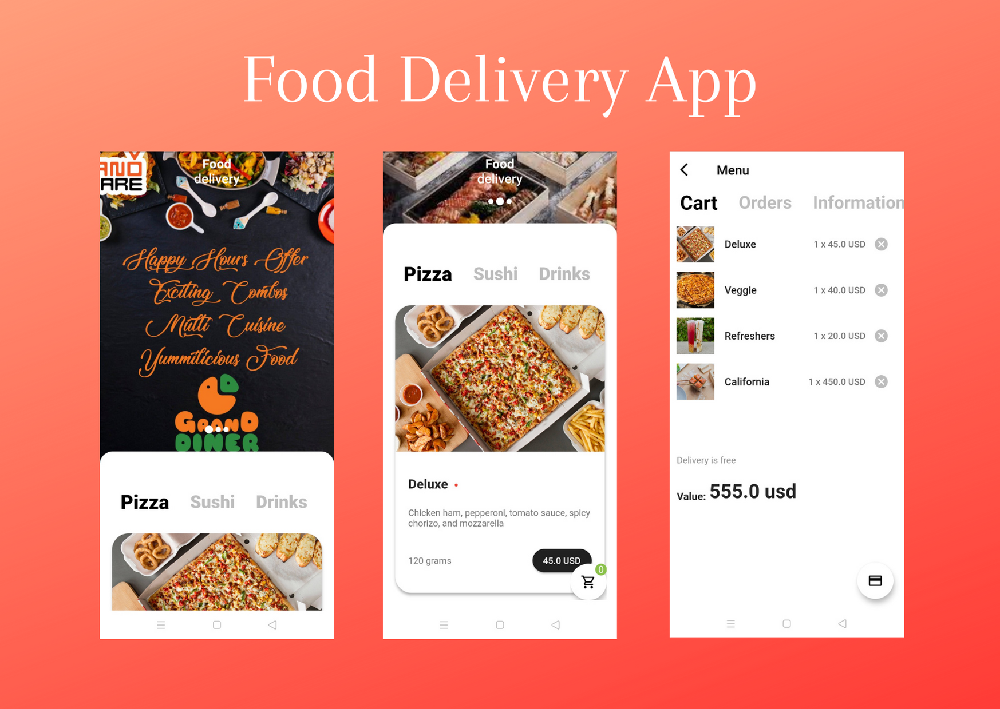

# Food Delivery App

A flutter application which implements the UI concept and animation flow of a food delivery application. 

It utilizes a mock repository as a dummy backend which provides the food items available inside the application, the banners being displayed on the home screen, and the ability to store and access cart for an individual by assuming the user is already signed in. 



- The Main Features of this application are:
1. Carousel slider to display the banners.
2. Allows navigation across different categories of available food items using tabbars.
3. Elegant UI workflow.
4. Add food items to the cart to buy them.
5. Floating Action Button keeps track of the number of different food items added to the cart and displays the same using an overlay on top of it.
6. Cart page where you can order food items or discard them if not required.

## Required Packages

This project relies on packages from [pub.dav](https://www.pub.dev/) which are:

#### State Management 
- [MobX](https://pub.dev/packages/mobx)
- [flutter_mobx](https://pub.dev/packages/flutter_mobx)
#### Network Image Caching
- [cached_network_image](https://pub.dev/packages/cached_network_image)
#### Image Slider
- [carousel_slider](https://pub.dev/packages/carousel_slider)
#### NoSQL Database
- [hive](https://pub.dev/packages/hive)
- [hive_flutter](https://pub.dev/packages/hive_flutter)
#### Network Connectivity
- [connectivity](https://pub.dev/packages/connectivity)

## Steps for development

### Prerequisites

You'll need to setup the IDE and mobile device emulator on your local system.

1. **Development Environment**: You'll need to have the following installed:
    - [Flutter SDK](https://flutter.dev/docs/get-started/install)
    - [Visual Studio Code](https://code.visualstudio.com/download) or [Android Studio](https://developer.android.com/studio) 

### Command Line Steps

For running the project on your local system, here's what you need to do.

1. Clone and change into the project.
    ```sh
    $ git clone https://github.com/Raunakk02/FoodDeliveryApp.git
    $ cd FoodDeliveryApp
    ```
1. Install packages
    ```sh
    $ flutter pub get
    ```
1. Start developing!